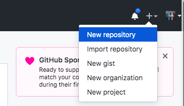
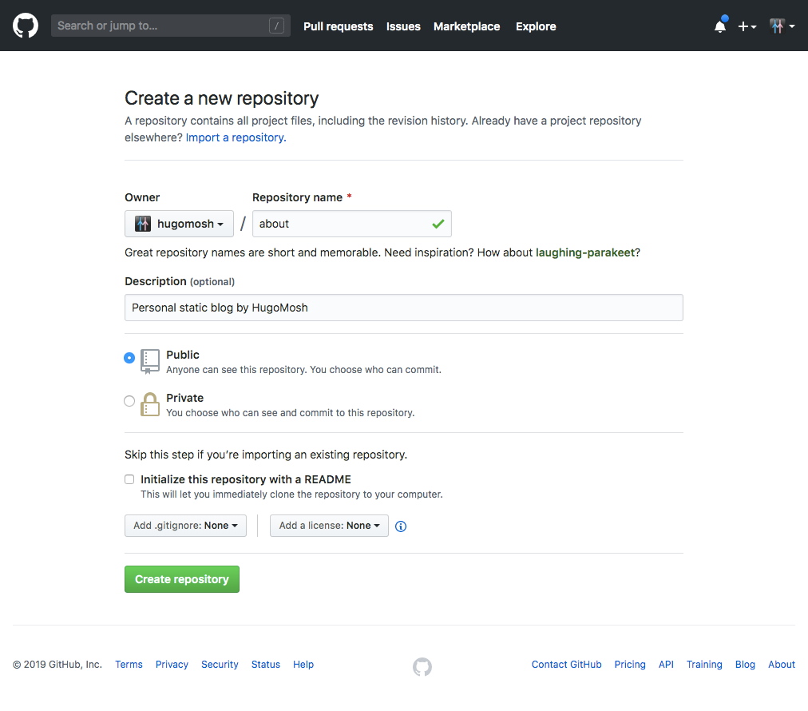

### ¿Cómo tener un blog/portafolio (bueno, bonito y gratis) con gatsby y github-pages?


La idea es tener un blog. Gatsby es una plataforma para publicar contenido estático, por ejemplo blogs y portafolios. Y github-pages ofrece un espacio en la web.

Hay dos opciones para montarlo en github-pages. Dentro de la página de un repositorio o una personal o de empresa.

Para este tutorial me voy a ir por la opción de tener un repositorio que sea el blog y éste tenga su propia github-page.

Entonces para nombrar el proyecto lo llamaré **about** pero puede ser _blog, aboutme, portafolio, etc._

## Requisitos

Puedes empezar sin saber mucho. El objetivo es que cualquiera pueda hacerlo. Gatsby, tiene mucho énfasis en esto, por lo que tiene su página de tutorial que cubre cualquier aspecto desde _setupear el ambiente_ hasta cosas más complejas. Te recomiendo echarle un ojo
https://www.gatsbyjs.org/tutorial/

Vamos a sumir ciertas cosas como manejo de terminal pero en cada paso lo detallaré.

## Instalar gatsby

**Requisitos**: Manejo básico de terminal, terminal con node y npm.

Para instalar gatsby sólo ejecuta `npm install -g gatsby-cli` dentro de la terminal.

> Tip básico: cuándo instalas paquetes globales no importa la ubicación (pwd) en la que te encuentres.


## Escoge un starter para Gatsby

Visita: https://www.gatsbyjs.org/starters/?v=2

Recomendados: [Gatsby Starter Blog](https://www.gatsbyjs.org/starters/gatsbyjs/gatsby-starter-blog/)

Tambien puedes no utilizar un starter

## Empieza un gatsby 

```bash
NOMBRE_DEL_REPO=about
URL_DEL_STARTER=https://github.com/gatsbyjs/gatsby-starter-blog
gatsby new $NOMBRE_DEL_REPO $URL_DEL_STARTER
```
que la terminal traduce a (en mi caso): `gatsby new about https://github.com/gatsbyjs/gatsby-starter-blog`

Recuerda la ubicación (el comando `pwd` te lo recuerda ; )

Ahora entra a la carpeta creada por el cliente de gatsby (gatsby-cli) y ordena el comando `develop`:

```bash
cd $NOMBRE_DEL_REPO
gatsby develop
```

¡Ya tienes un sitio corriendo en tu local: `http://localhost:8000`! Echalé un ojo en tu explorador. 

> Tip: Si algo falla: primero, siempre lee con cuidado el error o advertencia. Segundo, busca en internet el error, en caso de no poder resolverlo por ti mismo. Tercero, no dudes en contactarme, para ayudarte a resolverlo.

Para salir, y cerrar el proceso haz `CTRL+C`


## Crear un repositorio público en github

**Requisitos**: cuenta de github.

Ahora crea un nuevo repositorio de github.

En la esquina superior derecha de github:


Y ahora llena los datos como mejor te guste



## Sube tu repo para manternerlo sincronizado

Ahora regresa a la terminal y sincroniza tu repo en el branch `master`. Siguiendo las instrucciones de github.

>…or push an existing repository from the command line

```bash
#En mi caso es hugomosh/about, cambialo por tu caso ;) 
REPO=git@github.com:hugomosh/about.git 
git remote add origin $REPO
git push -u origin master
```

## Instala gh-pages

Dentro de la carpeta del proyecto. En mi caso, `about`. Instala el paquete [`gh-pages`](https://github.com/tschaub/gh-pages) que nos ayudara a publicar el contenido dentro del branch `gh-pages` del repo que acabamos de crear.

¿Utilizas `yarn`? Entonces: 
```bash
yarn add gh-pages -D
```
de lo contrario con `npm`. En otro post trataré de explicar cada uno y la diferencia. Mientras sugiero googlearlo.

```bash
npm install gh-pages --save-dev
``` 

## Añade la configuración necesaria para el deploy con gh-pages en gatsby

Son dos archivos que se van a modificar dentro del proyecto. El primero es el `package.json` y se le va a añadir `deploy` dentro de las `"scripts"`:

```json
 "deploy": "gatsby build --prefix-paths && gh-pages -d public"
```
El segundo es `gatsby.config` para añadir `pathPrefix` dentro del module.exports:

Este prefijo es el nombre de tu repo.

```js
module.exports = {
  pathPrefix: "/about",
}
```

## Deploy 

Ahora ejecuta el comando deploy con npm:

```bash
npm run deploy 
```

Tardará un ratito pues hace el build y luego el deploy que es subirlo a github en el branch gh-pages.

## Visita tu sitio

Ya puedes visitar tu sitio. Que si lo hiciste desde cero conmigo, pues solo, tendrás el proyecto de inicio o el _starter_ que hayas seleccionado.

La url es algo cercano a: http://%USERNAME%.github.io/%BLOGNAME%/ 

Ahora será tiempo de que conozcas los archivos, juegues con tu proyecto de gatsby y lo vayas modificando para que quede cómo quieras y logres tener el blog o portafolio que siempre soñaste ; )

En mi caso mi blog es: http://hugomosh.github.io/about/

